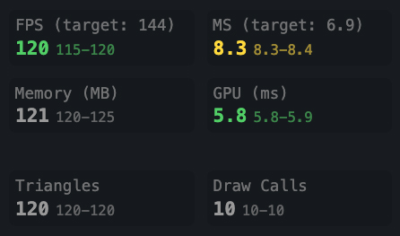
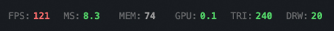
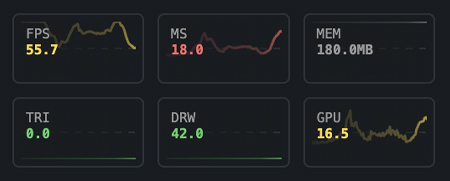

# leva-r3f-stats
A small Leva plugin to efficiently display React Three Fiber stats

[](https://www.npmjs.com/package/leva-r3f-stats)
[](https://JeffreyCastellano.github.io/leva-r3f-stats)

[**Live Demo**](https://JeffreyCastellano.github.io/leva-r3f-stats)

## Features

### 📊 Real-time Performance Metrics
- **FPS (Frames Per Second)** - Color-coded performance indicators with automatic threshold detection
- **Frame Time (MS)** - Monitor render performance with target-based warnings
- **Memory Usage** - Track heap memory consumption with automatic unit formatting (MB/GB)
- **GPU Time** - WebGL2 timer queries for accurate GPU measurements
- **CPU Time** - Frame processing time estimation
- **Triangle & Draw Calls** - Monitor scene complexity and rendering efficiency

### 🎯 Smart Target Detection
- **Automatic Refresh Rate Detection** - Detects display refresh rates from 30Hz to 360Hz
- **VSync Detection** - Real-time detection with pattern matching
- **Custom Performance Thresholds** - Set your own warning and critical levels
- **High Refresh Rate Support** - Optimized for high speed monitors (144Hz, 240Hz, etc.)

### 📈 Multiple Display Modes
- **Regular Mode** - Detailed grid view with labels and min/max values
- **Compact Mode** - Single-line display for minimal UI footprint
- **Graph Mode** - Real-time performance graphs with customizable height
- **Flexible Columns** - Configure column count for each display mode

### 🎨 Customization Options
- **Individual Stat Control** - Toggle and reorder any metric
- **Font Size Control** - Adjustable text size for all display modes
- **Color Themes** - Full control over warning colors and themes
- **Folder Organization** - Group stats in collapsible Leva folders

### ⚡ Performance Optimized
- **WebGL2 GPU Timing** - Direct GPU measurement via timer queries
- **WebGPU Support** - Experimental compute shader timing
- **Efficient Data Structures** - Ring buffers for minimal memory overhead
- **Configurable Update Rates** - Balance accuracy vs performance


## Storybook Examples

### Display Modes
- [Basic Example](https://JeffreyCastellano.github.io/leva-r3f-stats/?path=/story/leva-r3f-stats-basic--default) - Simple setup with default configuration
- [Compact Mode](https://JeffreyCastellano.github.io/leva-r3f-stats/?path=/story/leva-r3f-stats-compact--default) - Single-line display with adjustable font sizes
- [Graph Mode](https://JeffreyCastellano.github.io/leva-r3f-stats/?path=/story/leva-r3f-stats-graph--default) - Real-time performance graphs
- [Graph Compact](https://JeffreyCastellano.github.io/leva-r3f-stats/?path=/story/leva-r3f-stats-graph-compact--micro-graphs) - Minimal graphs with compact display

### Advanced Features
- [Extended Stats](https://JeffreyCastellano.github.io/leva-r3f-stats/?path=/story/leva-r3f-stats-extended--default) - All metrics including triangles and draw calls
- [Extended Compact](https://JeffreyCastellano.github.io/leva-r3f-stats/?path=/story/leva-r3f-stats-extended-compact--reordered-stats) - Complex scenes with custom stat ordering
- [Minimal Graphs](https://JeffreyCastellano.github.io/leva-r3f-stats/?path=/story/leva-r3f-stats-graph--minimal-graphs) - Compact graph display
- [Columns](https://JeffreyCastellano.github.io/leva-r3f-stats/?path=/story/leva-r3f-stats-columns--three-column-layout) - Balanced grid display
- [WebGPU Experiment](https://lhgjxs.csb.app/) - (https://codesandbox.io/p/sandbox/lhgjxs) External experimental WebGPU Compute Example


## Installation

```bash
npm install leva-r3f-stats
# or
yarn add leva-r3f-stats
# or
pnpm add leva-r3f-stats
# or
bun install leva-r3f-stats
```

## Peer Dependencies
Make sure you have these peer dependencies installed:

```json
{
  "@react-three/fiber": ">=8.0.0",
  "leva": ">=0.9.0",
  "react": ">=18.0.0",
  "react-dom": ">=18.0.0",
  "three": ">=0.140.0"
}
```

## Quick Start

```jsx
import { Canvas } from '@react-three/fiber';
import { useStatsPanel } from 'leva-r3f-stats';

function Scene() {
  useStatsPanel(); // That's it!
  
  return (
    <mesh>
      <boxGeometry />
      <meshStandardMaterial />
    </mesh>
  );
}

function App() {
  return (
    <Canvas>
      <Scene />
    </Canvas>
  );
}
```

## Options

```jsx
useStatsPanel({
  // Update interval in milliseconds (default: 100)
  updateInterval: 100,
  
  // Target framerate - null for auto-detect (default: null)
  targetFramerate: null,
  
  // Display mode options
  compact: false,              // Compact single-line display (default: false)
  graphHeight: 0,             // Graph height in pixels, 0 for text mode (default: 0)
  graphHistory: 100,          // Number of samples in graph (default: 100)
  
  // Column configuration
  columns: 2,                 // Default columns for regular mode
  columnsCompact: 4,          // Columns in compact mode (default: 4)
  columnsGraph: 2,            // Columns in graph mode (default: 2)
  
  // Styling options
  showColors: true,           // Show performance-based colors (default: true)
  defaultColor: '#999999',    // Default text color (default: '#999999')
  fontSize: 12,               // Font size in pixels (default: 12)
  showMinMax: true,           // Show min/max values (default: true)
  
  // Feature toggles
  trackCompute: false,        // Track WebGPU compute (experimental) (default: false)
  vsync: true,               // Enable VSync detection (default: true)
  
  // Leva integration
  order: -1,                 // Display order in Leva panel (default: -1)
  folder: null,              // Folder name or config (default: null)
  
  // Individual stat configuration
  stats: {
    fps:       { show: true, order: 0 },
    ms:        { show: true, order: 1 },
    memory:    { show: true, order: 2 },
    gpu:       { show: true, order: 3 },
    cpu:       { show: true, order: 4 },
    compute:   { show: true, order: 5 },
    triangles: { show: true, order: 6 },
    drawCalls: { show: true, order: 7 },
    vsync:     { show: true, order: 8 }
  }
});
```

## Target Framerate Configuration

The panel supports both automatic and manual target framerate settings:

```jsx
// Auto-detect based on display refresh rate and vsync
useStatsPanel({ 
  targetFramerate: null  // Default - auto-detects 60Hz, 120Hz, 144Hz, etc.
});

// Set a specific target
useStatsPanel({ 
  targetFramerate: 144   // Target 144 FPS
});

// Common gaming targets
useStatsPanel({ targetFramerate: 30 });   // Console target
useStatsPanel({ targetFramerate: 60 });   // Standard target  
useStatsPanel({ targetFramerate: 120 });  // High refresh target
useStatsPanel({ targetFramerate: 144 });  // Gaming monitor
useStatsPanel({ targetFramerate: 240 });  // Competitive gaming
```

The target framerate affects:
- Color coding thresholds (green/yellow/red)
- Performance warnings
- Labels showing "FPS (target: X)" and "MS (target: X)"
- Automatic adjustment of warning/critical thresholds

## Display Modes

### Regular Mode
Shows detailed statistics in a grid layout with labels and min/max values.


```jsx
useStatsPanel({ 
  compact: false,
  columns: 2,      // 2-column grid
  fontSize: 12     // Standard font size
});
```

### Compact Mode
Shows essential metrics in a minimal UI footprint.



```jsx
useStatsPanel({ 
  compact: true,
  columnsCompact: 4,  // 4 stats per row
  fontSize: 10        // Smaller text
});
```

### Graph Mode
Real-time performance graphs for visual monitoring.



```jsx
useStatsPanel({ 
  graphHeight: 48,    // 48px tall graphs
  columnsGraph: 2,    // 2 graphs per row
  graphHistory: 150   // Show last 150 samples
});
```


## Performance Thresholds

The panel automatically color-codes metrics based on performance:

- 🟢 **Green**: Good performance (FPS ≥ 80% of target)
- 🟡 **Yellow**: Warning (FPS 50-80% of target)
- 🔴 **Red**: Critical (FPS < 50% of target)

Example thresholds for 60 FPS target:
- Green: 48+ FPS (80% of 60)
- Yellow: 30-48 FPS (50-80% of 60)
- Red: <30 FPS (below 50% of 60)

## Advanced Usage

### Custom Stat Configuration
Control visibility and order of individual stats:

```jsx
useStatsPanel({
  stats: {
    fps: { show: true, order: 0 },      // Show first
    ms: { show: true, order: 1 },       // Show second
    memory: { show: false },            // Hide memory
    gpu: { show: true, order: 2 },      // Show third
    cpu: { show: false },               // Hide CPU
    triangles: { show: true, order: 3 }, // Show fourth
    drawCalls: { show: true, order: 4 }, // Show fifth
    vsync: { show: true, order: 5 }     // Show last
  }
});
```

### Folder Organization
Group stats in a Leva folder:

```jsx
// Simple folder
useStatsPanel({
  folder: 'Performance'
});

// Folder with options
useStatsPanel({
  folder: {
    name: 'Performance',
    collapsed: false  // Start expanded
  }
});
```

### Column Layouts
Different column counts for different modes:

```jsx
useStatsPanel({
  columns: 3,         // 3 columns in regular mode
  columnsCompact: 6,  // 6 columns in compact mode
  columnsGraph: 2,    // 2 columns in graph mode
});
```

### Font Size Control
Adjust text size for better readability:

```jsx
// Compact display with tiny text
useStatsPanel({
  compact: true,
  fontSize: 8
});

// Regular display with large text
useStatsPanel({
  compact: false,
  fontSize: 14
});

// Graph mode with standard text
useStatsPanel({
  graphHeight: 32,
  fontSize: 11
});
```

### Control Display Order
```jsx
// Stats panel appears at top by default (order: -1)
useStatsPanel(); 

// Custom order to control position
useStatsPanel({
  order: 5  // Lower numbers appear first
});

// Use with other Leva controls
const { speed } = useControls('Animation', {
  speed: { value: 1, min: 0, max: 5 }
}, { order: 0 }); // Appears after stats
```

### Performance Monitoring in Production
```jsx
// Optimized for production
useStatsPanel({
  updateInterval: 500,    // Update every 500ms
  compact: true,          // Use compact mode
  showMinMax: false,      // Disable min/max tracking
  fontSize: 9,            // Smaller text
  columnsCompact: 6       // More items per row
});
```

### WebGPU Compute Tracking
```jsx
// Enable experimental WebGPU compute timing
useStatsPanel({
  trackCompute: true,
  stats: {
    compute: { show: true, order: 5 }
  }
});
```

### Dynamic Configuration
```jsx
function Scene() {
  const isDev = process.env.NODE_ENV === 'development';
  
  useStatsPanel({
    // Different settings for dev vs prod
    updateInterval: isDev ? 100 : 500,
    compact: !isDev,
    showMinMax: isDev,
    graphHeight: isDev ? 32 : 0,
    fontSize: isDev ? 12 : 10,
    
    // Show more stats in development
    stats: {
      fps: { show: true },
      ms: { show: true },
      memory: { show: isDev },
      gpu: { show: true },
      cpu: { show: isDev },
      triangles: { show: isDev },
      drawCalls: { show: isDev }
    }
  });
}
```

## Metrics Explained

### Core Metrics

| Metric | Description | Good Values | Notes |
|--------|-------------|-------------|--------|
| **FPS** | Frames per second | Match display refresh rate | Color-coded based on target |
| **MS** | Frame render time | <16.67ms (60fps), <8.33ms (120fps) | Lower is better |
| **Memory** | JS heap usage | Depends on app | Chrome/Edge only |
| **GPU** | GPU processing time | <16.67ms (60fps) | WebGL2 timer queries |
| **CPU** | CPU processing time | <16.67ms (60fps) | Estimated from frame timing |

### Extended Metrics

| Metric | Description | When to Enable | Impact |
|--------|-------------|----------------|---------|
| **Compute** | WebGPU compute time | Using WebGPU | Requires `trackCompute: true` |
| **Triangles** | Triangle count | Complex scenes | Always available |
| **Draw Calls** | Number of draw calls | Optimization | Lower is better |
| **VSync** | Display refresh rate | Always useful | Auto-detected |

### Understanding the Values

**FPS (Frames Per Second)**
- Measures how many frames are rendered per second
- Higher is better, should match your display refresh rate
- Shows "FPS (target: X)" with your configured target

**MS (Milliseconds per Frame)**
- Time taken to render one frame
- Lower is better
- Shows "MS (target: X.X)" based on target framerate
- 60 FPS = 16.67ms, 144 FPS = 6.94ms

**Memory (MB)**
- JavaScript heap memory usage
- Only available in Chromium browsers
- Automatically scales to GB for large values

**GPU Time (ms)**
- Actual GPU execution time via WebGL2 timer queries
- Falls back to estimation (70% of frame time) if unavailable
- Critical for identifying GPU bottlenecks

**CPU Time (ms)**
- Estimated CPU processing time
- Calculated from frame timing data
- Helps identify CPU vs GPU bottlenecks

**Triangles**
- Number of triangles rendered per frame
- Auto-formatted (K for thousands, M for millions)
- Higher counts impact performance

**Draw Calls**
- Number of WebGL draw calls per frame
- Lower is better for performance
- Each call has overhead

**VSync**
- Detected display refresh rate
- Shows actual Hz when stable
- Helps set appropriate target framerate

## How It Works

### GPU Timing (WebGL2)
The library uses WebGL2's timer query extension for accurate GPU measurements:

1. Checks for `EXT_disjoint_timer_query_webgl2` support
2. Creates timer queries around render calls
3. Asynchronously retrieves GPU execution time
4. Handles GPU disjoint states gracefully
5. Falls back to estimation if unavailable

### WebGPU Support
For Three.js WebGPU renderer:

1. Detects WebGPU renderer automatically
2. Enables timestamp tracking
3. Resolves timestamps asynchronously
4. Tracks both render and compute passes
5. Zero configuration required

### VSync Detection
Advanced algorithm for accurate refresh rate detection:

1. Collects frame time samples (120 frame window)
2. Calculates average and standard deviation
3. Matches against known refresh rates (30-360Hz)
4. Requires stable frame timing for confidence
5. Updates dynamically as conditions change

### Performance Optimizations
- **Ring Buffers**: Fixed-size circular buffers prevent memory growth
- **Lazy Updates**: Configurable intervals reduce overhead
- **Conditional Rendering**: Only updates visible stats
- **Efficient Algorithms**: O(1) operations for most updates
- **Minimal DOM Updates**: Batched updates via React

## Browser Support

| Browser | Basic | Memory | GPU Timing | WebGPU | Notes |
|---------|-------|--------|------------|---------|--------|
| Chrome 113+ | ✅ | ✅ | ✅ | ✅ | Full support |
| Edge 113+ | ✅ | ✅ | ✅ | ✅ | Full support |
| Firefox | ✅ | ❌ | ⚠️ | ❌ | Limited GPU timing |
| Safari | ✅ | ❌ | ⚠️ | ❌ | Limited GPU timing |
| Opera | ✅ | ✅ | ✅ | ✅ | Full support |

### Feature Detection
The library automatically detects and adapts to available features:
- Falls back gracefully when features are unavailable
- No errors thrown for missing APIs
- Attempts best possible metrics for each browser


## Example

### Basic Setup
```jsx
import { Canvas } from '@react-three/fiber';
import { useStatsPanel } from 'leva-r3f-stats';
import { Leva } from 'leva';

function App() {
  return (
    <>
      <Leva />
      <Canvas>
        <Scene />
      </Canvas>
    </>
  );
}

function Scene() {
  useStatsPanel();
  
  return (
    <>
      <ambientLight />
      <mesh>
        <boxGeometry />
        <meshStandardMaterial />
      </mesh>
    </>
  );
}
```

### Gaming Monitor Setup (144Hz)
```jsx
function Scene() {
  useStatsPanel({
    targetFramerate: 144,
    graphHeight: 32,
    columnsGraph: 3,
    stats: {
      fps: { show: true, order: 0 },
      gpu: { show: true, order: 1 },
      cpu: { show: true, order: 2 }
    }
  });
}
```

### Minimal Production Setup
```jsx
function Scene() {
  useStatsPanel({
    compact: true,
    fontSize: 9,
    columnsCompact: 6,
    updateInterval: 250,
    showMinMax: false,
    stats: {
      fps: { show: true },
      gpu: { show: true },
      ms: { show: false },
      cpu: { show: false }
    }
  });
}
```

### Development Setup with Everything
```jsx
function Scene() {
  useStatsPanel({
    folder: {
      name: 'Performance Metrics',
      collapsed: false
    },
    targetFramerate: null, // Auto-detect
    graphHeight: 48,
    graphHistory: 200,
    columnsGraph: 2,
    fontSize: 12,
    trackCompute: true,
    stats: {
      fps: { show: true, order: 0 },
      ms: { show: true, order: 1 },
      gpu: { show: true, order: 2 },
      cpu: { show: true, order: 3 },
      memory: { show: true, order: 4 },
      compute: { show: true, order: 5 },
      triangles: { show: true, order: 6 },
      drawCalls: { show: true, order: 7 },
      vsync: { show: true, order: 8 }
    }
  });
}
```

### Conditional Rendering
```jsx
const SHOW_STATS = process.env.NODE_ENV === 'development' || 
                   new URLSearchParams(window.location.search).has('stats');

function Scene() {
  if (SHOW_STATS) {
    useStatsPanel({
      compact: false,
      targetFramerate: 60
    });
  }
  
  // Your scene...
}
```

## API Reference

### useStatsPanel(options?)
The main hook for adding stats to your scene.

**Parameters:**
- `options` (optional): StatsOptions configuration object

**Returns:**
- `null` - The hook handles everything internally

**Usage:**
Must be called inside a component that's within the R3F Canvas.

### stats(options?)
Leva plugin function for manual control integration.

```jsx
import { useControls } from 'leva';
import { stats } from 'leva-r3f-stats';

function Scene() {
  useControls({
    'Performance': stats({ compact: true })
  });
}
```

## Performance Tips
This plugin does its best to give you as many options as possible and is meant mostly for development. Updating values in React will always be less performant than other canvas based methods. That said there are a few things you can do to help performance...

### Optimization Strategies

1. **Reduce Update Frequency**
```jsx
   useStatsPanel({ updateInterval: 250 }); // 4 updates per second
```

2. **Use Compact Mode**
```jsx
   useStatsPanel({ compact: true, fontSize: 9 });
```

3. **Disable Unused Stats**
```jsx
   useStatsPanel({
     stats: {
       cpu: { show: false },
       memory: { show: false },
       triangles: { show: false },
       drawCalls: { show: false }
     }
   });
   ```

4. **Disable Min/Max Tracking**
```jsx
   useStatsPanel({ showMinMax: false });
```

5. **Conditional Loading**
```jsx
   const StatsPanel = lazy(() => import('leva-r3f-stats'));
```

### Performance Impact
Typical roughly tested overhead on modern hardware:
- CPU: <0.5% additional usage
- Memory: ~200KB including buffers
- GPU: Negligible (timer queries are async)
- Network: None (fully client-side)

## Troubleshooting

### Common Issues

**Stats not showing**
- Ensure hook is called inside Canvas component
- Check that Leva is rendered in your app
- Verify peer dependencies are installed
- Check browser console for errors

**GPU timing shows 0 or N/A**
- GPU timing requires WebGL2 context
- Check if `EXT_disjoint_timer_query_webgl2` is supported
- Some browsers/drivers disable GPU timing for security
- Try different browser or update graphics drivers

**Memory always shows 0**
- Memory API only available in Chromium browsers
- Check `performance.memory` in console
- Not available in Firefox, Safari

**Colors not working**
- Ensure `showColors: true` (default)
- Check if `defaultColor` is overriding
- Verify target framerate is set correctly

**Graph mode not displaying**
- Set `graphHeight` to value > 0
- Check Canvas 2D context support
- Ensure sufficient panel width

**VSync detection failing**
- Requires stable frame timing
- May not work with irregular workloads
- Disable with `vsync: false` if problematic

### Debug Mode
Hacky, I know...
```jsx
// Enable verbose logging
if (process.env.NODE_ENV === 'development') {
  window.LEVA_R3F_STATS_DEBUG = true;
}
```
## Acknowledgments
- Built for @react-three/fiber
- UI powered by Leva
- Stats-Gl [https://github.com/RenaudRohlinger/stats-gl/]
- Stats.js [https://github.com/mrdoob/stats.js]
- R3F Perf [https://github.com/utsuboco/r3f-perf]
- GameStats [https://github.com/ErikSom/gamestats]


## Future Considerations

- [ ] Better GPU timing measurement
- [ ] Custom monitoring events like in GameStats
- [ ] WASM monitoring
- [ ] Full non-expermental WebGPU compute tracking
- [ ] Headless & Traditional Canvas Mode outside of plugin
- [ ] Full Performance report as in R3F Perf
- [ ] Performance alerts
- [ ] Real-time network performance monitoring

## License
MIT © Jeffrey Castellano  
See [LICENSE](LICENSE) for more information.

## Support
- 🐛 Issues: [GitHub Issues](https://github.com/JeffreyCastellano/leva-r3f-stats/issues)