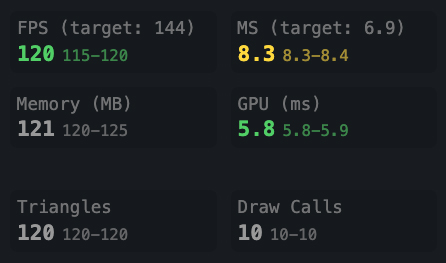
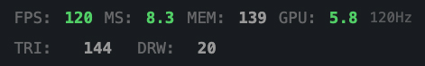

# leva-r3f-stats
A small Leva plugin to display React Three Fiber stats

[](https://www.npmjs.com/package/leva-r3f-stats)
[](https://JeffreyCastellano.github.io/leva-r3f-stats)

[**Live Demo**](https://JeffreyCastellano.github.io/leva-r3f-stats)

## Features

### 📊 Real-time Performance Metrics
- **FPS (Frames Per Second)** - Color-coded performance indicators with automatic threshold detection
- **Frame Time (MS)** - Monitor render performance with target-based warnings
- **Memory Usage** - Track heap memory consumption with automatic unit formatting (MB/GB)
- **GPU Time** - Estimated GPU utilization based on frame timing analysis
- **Triangle & Draw Calls** - Monitor scene complexity and rendering efficiency

### 🎯 Smart Target Detection
- **Automatic Refresh Rate Detection** - Detects display refresh rates from 30Hz to 360Hz
- **VSync Detection** - Real-time detection with confidence levels
- **Custom Performance Thresholds** - Set your own warning and critical levels
- **High Refresh Rate Support** - Optimized for gaming monitors (144Hz, 240Hz, etc.)

### 📈 Extended Statistics
- **Min/Max Tracking** - Rolling window statistics with configurable reset intervals
- **Smoothed Values** - Exponential moving averages for stable readings
- **Outlier Filtering** - Remove spikes for accurate performance assessment
- **Efficient Memory Usage** - Circular buffers minimize overhead

### 🎨 Flexible Display Options
- **Compact Mode** - Single-line display for minimal UI footprint
- **Grid Layout** - Detailed view with all metrics and statistics
- **Customizable Colors** - Full control over warning colors and themes
- **Modular Metrics** - Toggle individual metric groups on/off

### ⚡ Performance Optimized
- **Minimal Overhead** - Minimizes (as much as possible) app performance impact
- **Efficient Data Structures** - Optimized circular buffers and algos
- **Configurable Update Rates** - Balance accuracy vs performance
- **Smart Frame Tracking** - Attempted FPS accuracy while reducing dependencies

## Installation

```bash
npm install leva-r3f-stats
# or
yarn add leva-r3f-stats
# or
pnpm add leva-r3f-stats
# or
bun install leva-r3f-stats
```

## Peer Dependencies
Make sure you have these peer dependencies installed:

```json
{
  "@react-three/fiber": ">=8.0.0",
  "leva": ">=0.9.0",
  "react": ">=18.0.0",
  "react-dom": ">=18.0.0",
  "three": ">=0.140.0"
}
```

## Quick Start

```jsx
import { Canvas } from '@react-three/fiber';
import { useStatsPanel } from 'leva-r3f-stats';

function Scene() {
  useStatsPanel(); // That's it!
  
  return (
    <mesh>
      <boxGeometry />
      <meshStandardMaterial />
    </mesh>
  );
}

function App() {
  return (
    <Canvas>
      <Scene />
    </Canvas>
  );
}
```

## Options

```jsx
useStatsPanel({
  // Update interval in milliseconds (default: 100)
  updateInterval: 100,
  // Target framerate - null for auto-detect (default: null)
  targetFramerate: null,
  // Compact display mode (default: false)
  compact: false,
  // Show color coding for performance (default: true)
  showColors: true,
  // Default color when showColors is false (default: '#999999')
  defaultColor: '#999999',
  // Show min/max values (default: true)
  showMinMax: true,
  // Track WebGPU compute (experimental) (default: false)
  trackCompute: false,
  // Show triangle/draw call counts (default: false)
  showTriangles: false,
  // Enable VSync detection (default: true)
  vsync: true,
  // Control display order in Leva panel (default: -1, appears at top)
  order: 1,
});
```

## Display Modes

### Normal Mode
Shows detailed statistics in a grid layout with labels and min/max values.



```jsx
useStatsPanel({ compact: false });
```

### Compact Mode
Shows essential metrics in a single line for minimal UI footprint.



```jsx
useStatsPanel({ compact: true });
```

## Performance Thresholds
The panel automatically color-codes metrics based on performance:

- 🟢 Green: Good performance (FPS ≥ 80% of target)
- 🟡 Yellow: Warning (FPS 50-80% of target)
- 🔴 Red: Critical (FPS < 50% of target)

## Extended Usage

### Custom Target Framerate
```jsx
// Set a specific target framerate
useStatsPanel({ targetFramerate: 144 });

// Auto-detect based on display
useStatsPanel({ targetFramerate: null });
```

### Show Additional Metrics
```jsx
// Show triangle and draw call counts
useStatsPanel({ showTriangles: true });

// Disable VSync detection
useStatsPanel({ vsync: false });
```

### Custom Styling
```jsx
// Use custom colors
useStatsPanel({
  showColors: false,
  defaultColor: '#00ff00'
});
```

### Control Display Order
```jsx
// Stats panel appears at top by default (order: -1)
useStatsPanel(); // Appears first

// Set custom order to control position in Leva panel  
useStatsPanel({
  order: 5  // Lower numbers appear first, higher numbers appear later
});

// Use with other controls
const controls = useControls({
  // This will appear after stats since stats defaults to -1
  myControl: { value: 0 }
}, { order: 0 });
```

### Performance Monitoring in Production
```jsx
// Reduce update frequency for production
useStatsPanel({
  updateInterval: 500, // Update every 500ms
  compact: true,       // Use compact mode
  showMinMax: false    // Hide min/max for cleaner UI
});
```

## Metrics Explained

### FPS (Frames Per Second)
- What it measures: How many frames are rendered per second
- Good values: Matching your display's refresh rate (60, 120, 144, etc.)
- Color coding: Green (≥80% target), Yellow (50-80%), Red (<50%)

### MS (Frame Time)
- What it measures: Time taken to render one frame in milliseconds
- Good values: <16.67ms for 60fps, <8.33ms for 120fps
- Calculation: Uses rolling average with outlier filtering

### Memory (MB)
- What it measures: JavaScript heap memory usage
- Browser support: Chrome/Edge only
- Auto-scaling: Automatically converts to GB for large values

### GPU (ms)
- What it measures: Estimated GPU processing time
- Calculation: Approximately 70% of total frame time
- Note: This is an estimation, not a direct measurement

### Triangles
- What it measures: Number of triangles rendered per frame
- Format: Auto-scales (K for thousands, M for millions)
- Enable: Set showTriangles: true

### Draw Calls
- What it measures: Number of draw calls per frame
- Performance impact: Lower is generally better
- Enable: Set showTriangles: true

### VSync
- What it measures: Detected display refresh rate
- Confidence: Based on frame time consistency
- Disable: Set vsync: false

## How It Works

### FPS Calculation
The plugin's approach to FPS measurement:

- Frame Timestamp Tracking: Records precise timestamps for each frame
- Rolling Window: Maintains timestamps from the last second
- Actual Count: Counts frames within the window for true FPS
- Smoothing: Applies averaging to reduce jitter

### Memory Tracking
- Uses the performance.memory API when available
- Updates with exponential moving average (EMA) for stability
- Automatically converts units (MB to GB) for large values

### GPU Time Estimation
- Estimates GPU time as approximately 70% of total frame time
- Provides a rough indication of GPU vs CPU bottlenecks
- Smoothed with EMA for stable readings

### VSync Detection
 Algorithm for detecting display refresh rate via stats-gl and others:

- Frame Time Analysis: Collects frame time samples
- Statistical Analysis: Calculates mean + standard deviation
- Pattern Matching: Compares against known refresh rates
- Confidence Scoring: Provides reliability metric

### Min/Max Tracking
- Uses circular buffers for better memory usage
- Implements rolling 5-second windows
- Automatically resets to prevent stale data

## Browser Support

| Browser | Basic Support | Memory Tracking | GPU Tracking | Notes |
|---------|---------------|----------------|--------------|-------|
| Chrome  | ✅            | ✅             | ✅           | Full support |
| Edge    | ✅            | ✅             | ✅           | Full support |
| Firefox | ✅            | ❌             | ⚠️           | No mem. API, limited GPU |
| Safari  | ✅            | ❌             | ⚠️           | No mem. API, limited GPU |
| Opera   | ✅            | ✅             | ✅           | Full support |

### ⚡ WebGPU Support (Experimental)
The library includes experimental support for WebGPU compute tracking when using Three.js WebGPURenderer.

#### Features
- **Compute Pass Timing** - Monitor WebGPU compute shader execution time
- **Detection** - Detects WebGPU renderer and required features
- **Fallback** - Silently disables if WebGPU or timestamp-query unavailable
- **Zero Configuration** - Just enable with `trackCompute: true`

#### Requirements
- Three.js r147+ with WebGPURenderer
- Browser with WebGPU support (Chrome 113+)
- GPU with timestamp-query feature support

#### Display

Normal Mode: Shows "Compute (ms)" as a separate metric
Compact Mode: Shows "CPT: X.X" when compute time > 0

#### Usage
```jsx
function Scene() {
  // Enable compute tracking
  useStatsPanel({ 
    trackCompute: true,
    showTriangles: true
  });
  
  // Your WebGPU compute nodes and scene...
}


## Performance Impact
The library is designed for minimal overhead:

- CPU Usage: <0.5% on modern hardware
- Memory Usage: ~200KB including buffers
- Update Frequency: Configurable (default 100ms)

## Optimization Tips

### Production Settings:
```jsx
useStatsPanel({
  updateInterval: 500,  // Reduce update frequency
  compact: true,        // Use compact mode
  showMinMax: false,    // Disable min/max tracking
  showTriangles: false  // Disable triangle counting
});
```

### Conditional Rendering:
```jsx
const showStats = process.env.NODE_ENV === 'development';

function Scene() {
  showStats && useStatsPanel();
  // ...
}
```

## API Reference

### useStatsPanel(options?)
The main hook for adding stats to your scene.

#### Parameters
- options (optional): Configuration object

#### Returns
- null - The hook handles everything internally

### stats(options?)
Leva plugin function for manual control integration.

```jsx
import { useControls } from 'leva';
import { stats } from 'leva-r3f-stats';

function Scene() {
  useControls({
    'Performance': stats({ compact: true })
  });
}
```

## TypeScript
The library is written in TypeScript and includes full type definitions.

```typescript
import { StatsOptions, StatsData } from 'leva-r3f-stats';

const options: StatsOptions = {
  compact: true,
  targetFramerate: 144,
  showColors: true
};
```

## Examples
- [Basic Example](https://JeffreyCastellano.github.io/leva-r3f-stats/?path=/story/basic--default) - Simple scene with stats panel.
- [Stress Test Example](https://JeffreyCastellano.github.io/leva-r3f-stats/?path=/story/stress-test--default) - Heavy scene to test performance monitoring.
- [Custom Styling Example](https://JeffreyCastellano.github.io/leva-r3f-stats/?path=/story/styling--custom-colors) - Shows how to customize colors and appearance.
- [Production Example](https://JeffreyCastellano.github.io/leva-r3f-stats/?path=/story/production--optimized) - Optimized settings for production use.

## Development

```bash
# Clone the repository
git clone https://github.com/JeffreyCastellano/leva-r3f-stats.git
cd leva-r3f-stats

# Install dependencies
npm install

# Run storybook for development
npm run storybook

# Build the library
npm run build

# Run tests
npm test

# Build storybook for deployment
npm run build-storybook
```

## Project Structure

```
leva-r3f-stats/
├── src/
│   ├── components/    # React components
│   ├── hooks/         # React hooks
│   ├── utils/         # Utility functions
│   ├── store/         # State management
│   └── types/         # TypeScript types
├── stories/           # Storybook stories
├── examples/          # Example implementations
└── dist/              # Build output
```

## Troubleshooting

### Stats not showing
- Make sure the hook is called inside a component that's within the Canvas
- Check that Leva is properly installed and configured
- Verify peer dependencies are installed

### Memory always shows 0
- Memory tracking only works in Chromium-based browsers
- Check if performance.memory is available in your browser

### FPS seems incorrect
- The FPS counter shows actual rendered frames, not potential frames
- Check if your browser's dev tools are affecting performance
- Try different updateInterval values

### Colors not working
- Ensure showColors is set to true (default)
- Check if defaultColor is overriding the dynamic colors

## Roadmap

- [ ] Direct GPU timing measurement
- [ ] Network request monitoring
- [ ] WASM monitoring
- [ ] WebGPU compute tracking

## Acknowledgments
- Built for @react-three/fiber
- UI powered by Leva
- Built on the back of Stat-Gl & Stats.js [https://github.com/RenaudRohlinger/stats-gl/]

## License
MIT © Jeffrey Castellano  
See [LICENSE](LICENSE) for more information.

## Support
- 🐛 Issues: [GitHub Issues](https://github.com/JeffreyCastellano/leva-r3f-stats/issues)