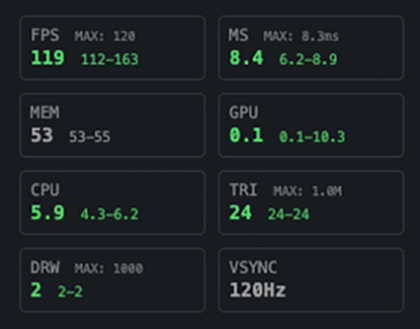

# leva-r3f-stats

Real-time performance monitoring for React Three Fiber applications

[](https://www.npmjs.com/package/leva-r3f-stats)
[](https://JeffreyCastellano.github.io/leva-r3f-stats)


[**Live Demo**](https://JeffreyCastellano.github.io/leva-r3f-stats) | [**Storybook**](https://JeffreyCastellano.github.io/leva-r3f-stats)

## Quick Start

### 1. Install

```bash
npm install leva-r3f-stats
```

### 2. Add to your scene

```jsx
import { useStatsPanel } from 'leva-r3f-stats';

function Scene() {
  useStatsPanel(); // That's it! Stats will appear in your Leva panel
  
  return (
    <mesh>
      <boxGeometry />
      <meshStandardMaterial />
    </mesh>
  );
}
```

### 3. Complete example

```jsx
import { Canvas } from '@react-three/fiber';
import { Leva } from 'leva';
import { useStatsPanel } from 'leva-r3f-stats';

function App() {
  return (
    <>
      <Leva />
      <Canvas>
        <Scene />
      </Canvas>
    </>
  );
}

function Scene() {
  useStatsPanel();
  
  return (
    <>
      <ambientLight />
      <mesh>
        <boxGeometry />
        <meshStandardMaterial />
      </mesh>
    </>
  );
}
```

## Common Configurations

### Minimal Setup (Production)
```jsx
useStatsPanel({
  compact: true,           // Single-line display
  updateInterval: 500,     // Update every 500ms
  fontSize: 9              // Smaller text
});
```

### Development Setup
```jsx
useStatsPanel({
  graphHeight: 48,         // Show graphs
  showMinMax: true,        // Track min/max values
  stats: {
    triangles: { show: true },
    drawCalls: { show: true }
  }
});
```

### Graph Mode
```jsx
useStatsPanel({
  graphHeight: 48,         // 48px tall graphs
  graphHistory: 150,       // Show last 150 frames
  columns: 3               // 3 graphs per row
});
```

## What You See

### Metrics Displayed

| Metric | What it means | Good values |
|--------|--------------|-------------|
| **FPS** | Frames per second | Should match your display (60, 120, 144 Hz) |
| **MS** | Time to render frame | <16.67ms for 60 FPS |
| **Memory** | JavaScript heap usage | Depends on your app |
| **GPU** | GPU processing time | <16.67ms for 60 FPS |
| **Triangles** | Polygons rendered | <1M for good performance |
| **Draw Calls** | Render operations | <1000 for good performance |

### Color Coding

- 🟢 **Green**: Good performance
- 🟡 **Yellow**: Warning - slight performance issues
- 🔴 **Red**: Critical - significant performance issues

## Display Modes

### Regular Mode (Default)

```jsx
useStatsPanel({ compact: false });
```

### Compact Mode

```jsx
useStatsPanel({ compact: true });
```

### Graph Mode

```jsx
useStatsPanel({ graphHeight: 48 });
```

## All Options

```jsx
useStatsPanel({
  // Display modes
  compact: false,              // Compact single-line display
  graphHeight: 0,             // Graph height in pixels (0 = text mode)
  graphHistory: 100,          // Number of samples in graph
  
  // Update settings
  updateInterval: 100,        // Update frequency in ms
  targetFramerate: null,      // Auto-detect display refresh rate
  
  // Layout
  columns: 2,                 // Columns in regular mode
  columnsCompact: 4,          // Columns in compact mode
  fontSize: 12,               // Font size in pixels
  
  // Features
  showColors: true,           // Performance-based colors
  showMinMax: true,           // Show min/max values
  vsync: true,                // VSync detection
  
  // Performance budgets
  trianglesBudget: 1000000,   // Triangle warning threshold
  drawCallsBudget: 1000,      // Draw call warning threshold
  
  // Leva integration
  order: -1,                  // Panel order
  folder: null,               // Folder name or config
  
  // Individual stats control
  stats: {
    fps:       { show: true, order: 0 },
    ms:        { show: true, order: 1 },
    memory:    { show: true, order: 2 },
    gpu:       { show: true, order: 3 },
    cpu:       { show: true, order: 4 },
    triangles: { show: true, order: 5 },
    drawCalls: { show: true, order: 6 },
    vsync:     { show: false, order: 7 },
    compute:   { show: false, order: 8 }  // WebGPU only
  }
});
```

## Advanced Examples

### Custom Stat Selection
Show only what you need:
```jsx
useStatsPanel({
  stats: {
    fps: { show: true },
    ms: { show: true },
    memory: { show: false },    // Hide memory
    gpu: { show: true },
    cpu: { show: false },       // Hide CPU
    triangles: { show: true },
    drawCalls: { show: true }
  }
});
```

### Folder Organization
Group stats in a Leva folder:
```jsx
useStatsPanel({
  folder: 'Performance'
});

// Or with options
useStatsPanel({
  folder: {
    name: 'Performance',
    collapsed: false
  }
});
```

### Performance Budgets
Set limits for visual warnings:
```jsx
// Mobile/low-end
useStatsPanel({
  trianglesBudget: 100000,   // 100k triangles
  drawCallsBudget: 100       // 100 draw calls
});

// High-end desktop
useStatsPanel({
  trianglesBudget: 5000000,  // 5M triangles
  drawCallsBudget: 5000      // 5k draw calls
});
```

### Dynamic Configuration
Different settings for dev vs production:
```jsx
const isDev = process.env.NODE_ENV === 'development';

useStatsPanel({
  compact: !isDev,
  graphHeight: isDev ? 32 : 0,
  updateInterval: isDev ? 100 : 500,
  showMinMax: isDev,
  stats: {
    triangles: { show: isDev },
    drawCalls: { show: isDev }
  }
});
```

## Features

### Core Features
- **Real-time Metrics** - FPS, frame time, memory, GPU/CPU usage
- **Auto Refresh Rate Detection** - Adapts to 60Hz, 120Hz, 144Hz+ displays
- **Multiple Display Modes** - Text, compact, or graph visualization
- **Performance Budgets** - Visual warnings for triangle and draw call limits
- **Color-coded Indicators** - Green/yellow/red performance states

### Advanced Features
- **WebGL2 GPU Timing** - Accurate GPU measurements via timer queries
- **WebGPU Support** - Experimental compute shader timing
- **VSync Detection** - Real-time refresh rate detection
- **Custom Thresholds** - Set your own warning levels
- **Flexible Layouts** - Configure columns and font sizes

## Browser Support

| Browser | Core | Memory | GPU Timing | WebGPU |
|---------|------|--------|------------|---------|
| Chrome/Edge | ✅ | ✅ | ✅ | ✅ |
| Firefox | ✅ | ❌ | ⚠️ | ❌ |
| Safari | ✅ | ❌ | ⚠️ | ❌ |

## Performance Tips

1. **Reduce update frequency for production**
   ```jsx
   useStatsPanel({ updateInterval: 500 });
   ```

2. **Use compact mode to save space**
   ```jsx
   useStatsPanel({ compact: true });
   ```

3. **Disable unused stats**
   ```jsx
   useStatsPanel({
     stats: {
       cpu: { show: false },
       memory: { show: false }
     }
   });
   ```

## Troubleshooting

**GPU timing shows 0 or N/A**
- Requires WebGL2 context with timer query support
- Some browsers disable GPU timing for security
- Try Chrome/Edge for best support

**Memory shows 0**
- Only available in Chromium browsers
- Not supported in Firefox/Safari

**Stats not appearing**
- Make sure Leva is installed and `<Leva />` is rendered
- Check that `useStatsPanel()` is called inside a Three.js component

## Links

- [Live Demo](https://JeffreyCastellano.github.io/leva-r3f-stats)
- [Storybook Examples](https://JeffreyCastellano.github.io/leva-r3f-stats)
- [NPM Package](https://www.npmjs.com/package/leva-r3f-stats)
- [GitHub Repository](https://github.com/JeffreyCastellano/leva-r3f-stats)

## Acknowledgments

Built on top of amazing libraries:
- [@react-three/fiber](https://github.com/pmndrs/react-three-fiber)
- [Leva](https://github.com/pmndrs/leva)
- Inspired by [Stats-GL](https://github.com/RenaudRohlinger/stats-gl), [Stats.js](https://github.com/mrdoob/stats.js), [R3F-Perf](https://github.com/utsuboco/r3f-perf)

## License

MIT © Jeffrey Castellano